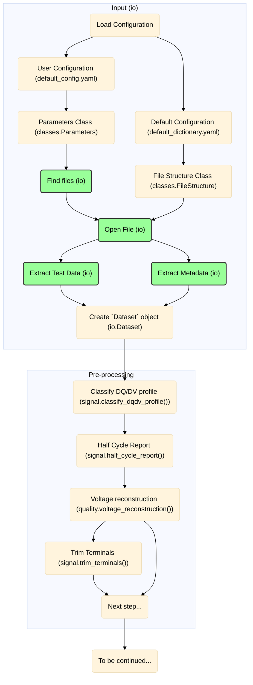

# Workflow

The following diagram gives a high level overview of the flow of data through the various steps in processing.

## Overview

```mermaid
%%{init: {'theme': 'base', 'themeVariables': { 'primaryTextColor': '#000', 'nodeTextColor': '#000', 'lineColor': '#000'}}}%%
graph TD

    subgraph "Input (io)"
      LC(Load Configuration)
      UC("User Configuration (default_config.yaml)")
      PARAMETERS("Parameters Class (classes.Parameters)")
      DC("Default Configuration (default_dictionary.yaml)")
      FILESTRUCTURE("File Structure Class (classes.FileStructure)")
      FF("Find files (io)")
      OF("Open File (io)")
      ED("Extract Test Data (io)")
      EM("Extract Metadata (io)")
      DS("Create `Dataset` object (io.Dataset)")
    end

    subgraph "Pre-processing"
      DQDV("Classify DQ/DV profile (signal.classify_dqdv_profile())")
      HC("Half Cycle Report (signal.half_cycle_report())")
      VR("Voltage reconstruction (quality.voltage_reconstruction())")
      TT("Trim Terminals (signal.trim_terminals())")
      NS("Next step...")
    end

    LC --> UC
    LC --> DC
    UC --> PARAMETERS
    PARAMETERS --> FF
    FF --> OF
    DC --> FILESTRUCTURE
    FILESTRUCTURE --> OF
    OF --> ED
    OF --> EM

    ED --> DS
    EM --> DS
    DS --> DQDV
    DQDV --> HC("Half Cycle Report (signal.half_cycle_report())")
    HC --> VR("Voltage reconstruction (quality.voltage_reconstruction())")
    VR --> TT("Trim Terminals (signal.trim_terminals())")
    TT --> NS
    VR --> NS
    NS --> TBC("To be continued...")


    %% Define the custom styles
    classDef greenIO fill:#9f9,color:#000,stroke:#333,stroke-width:2px
    classDef redNode fill:#f99,stroke:#333,stroke-width:2px
    classDef blueSub fill:#e1f5fe,stroke:#01579b,stroke-width:2px

    class FF,OF,ED,EM greenIO

    %% Hyperlinks to modules for each step
    click UC,DC "https://github.com/yggdrasil-materials/ratatosk/bob/main/src/ratatosk/default_config.yaml"
    click DC "https://github.com/yggdrasil-materials/ratatosk/bob/main/src/ratatosk/default_dictionary.yaml"
    click PARAMETERS "https://github.com/yggdrasil-materials/ratatosk/bob/main/src/ratatosk/classes.py"
    click FILESTRUCTURE "https://github.com/yggdrasil-materials/ratatosk/bob/main/src/ratatosk/classes.py"
    click FF,OF,ED,EM,DS "https://github.com/yggdrasil-materials/ratatosk/bob/main/src/ratatosk/io.py"
    click DQDV,HC,TT "https://github.com/yggdrasil-materials/ratatosk/bob/main/src/ratatosk/signal.py"
    click VR "https://github.com/yggdrasil-materials/ratatosk/bob/main/src/ratatosk/quality.py"

```
